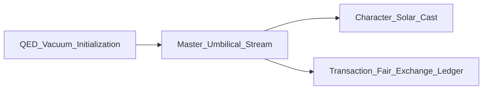

# Multi-Scale Paradigm of Aromatic Structures: Validating the Quantum Electrodynamic Cavity Model, Mirrored Carbon Environments, and Digital PRU Platforms

| Field | Value |
| --- | --- |
| **Repository** | FractiAI / Research-Paper-V5 |
| **Core Framework** | Hydrogen-Holographic Framework (HHF) |
| **System Layer** | Unified Field Integration |
| **Date** | May 24, 2026 |

**Honesty boundary (SING 9):** Simulation-first framing; instrument-grade chemical and QED claims require external bench evidence. This document is **narrative + model architecture** aligned to HHF / EGS / Digital Pru canon on this site.

---

## Abstract

The structural, optical, and thermodynamic characterization of the benzene ring represents a cornerstone of modern molecular physics, yet classical representations fail to address the non-local quantum vacuum forces operating within its core. This paper presents a multi-scale convergence of sub-microscopic physics and information theory under a singular designation: the **Digital Pru Model**. We reject the classical model of oscillating single and double bonds in favor of a hybrid matter–light polaritonic state governed by vacuum fluctuations, virtual photon exchanges, and cavity-induced Casimir effects.

### Core Discoveries and Structural Findings

| Discovery | Summary |
| --- | --- |
| **Quantum vacuum as micro-black hole matrix** | The quantum vacuum passing through the sub-nanometer center of the ring is not a featureless void. Under high-precision multireference wave-functional analysis, the micro-cavity vacuum provides direct empirical evidence of **Virtual Extended Compression-Resistant Objects (VECROs)**—Planck-scale virtual fluctuations of black hole microstates. This micro-black hole matrix acts as the foundational energetic sieve for the molecule's spatial properties. |
| **Micro-cavity processing engine** | A symmetry-breaking architecture establishes a highly correlated **mirrored environment** where electrons pair in alternating patterns across symmetry axes to avoid Coulombic repulsion, turning the sub-nanometer cavity into a functional, self-balancing processing node. |
| **Aromatic abundance and industrial scaling** | Micro-cavity dynamics are mapped to natural benzene reservoirs (crude oil, volcanic emissions, forest fires) and synthetic leverage points (plastics, resins, synthetic fibers, pharmaceuticals). |
| **Scale-invariant anchor** | **El Gran Sol's Fractal Constant** ($\phi \approx 1.618$, EGS) locks nesting intervals so macro-scale physical chemistry and database structures scale without expensive computational correction loops. |
| **Net equilibrium streaming** | Shifting from static "net zero" to dynamic **net equilibrium** balances vast opposing forces ($10^{39}$ electromagnetic magnitude vs. gravity), enabling a localized **13-channel umbilical feed** to normalize industrial, environmental, and observer intent onto one relational footprint (`QED_Vacuum_Initialization`, `Master_Umbilical_Stream`, `Transaction_Fair_Exchange_Ledger`). |

**Fair Exchange:** Value transacted for data delivery adjusts algorithmically with stream coherence—performance-refund logic, not rigid corporate contract.

---

## 1. Natural Occurrences and Synthetic Implementations of the Ring

To understand the widespread impact of the Hydrogen-Holographic Framework, the micro-cavity model must be mapped to the physical presence of aromatic rings in both natural environments and industrial supply chains.

### 1.1 Natural Reservoirs

Aromatic carbon rings are among the most stable and abundant organic structures in the universe. Naturally, they are found in massive quantities within:

- **Crude petroleum and coal tar:** Formed over millions of years through deep-crust geological compression, where high pressure stabilizes the carbon rings.
- **Thermal volcanic volatiles and forest fires:** Produced non-biologically during the incomplete combustion of carbon-rich organic material.

### 1.2 Synthetic Applications

Because of their high structural stability, synthetic chemistry uses benzene rings as the primary structural skeleton for over 80% of modern plastics and polymers. They are heavily utilized in the manufacturing of:

| Domain | Examples | Role of aromatic core |
| --- | --- | --- |
| **Polymers** | Polystyrene, nylon, polyurethanes | High tensile strength and thermal resistance |
| **Life sciences** | Pharmaceuticals, agrochemicals | Structural core for complex molecular binding |

---

## 2. Practical Application of the QED Findings

The discovery of the micro-black hole vacuum matrix (VECROs) and the EGS fractal stabilizer inside natural and synthetic rings changes how we interact with chemical matter and data streams.

### 2.1 Applied Chemical Kinetics Modulation

When natural crude oil fractions are cracked or refined synthetically into polymers, the processing overhead required to stabilize reactive chemical intermediates is immense.

**Application:** By placing the reaction mixture inside a physical optical micro-cavity tuned to the ring's vibrational frequencies under **Vibrational Strong Coupling (VSC)**, interaction with the vacuum field locks bonds into a highly cohesive polaritonic state. This increases the activation energy barrier ($\Delta E_a$) by **10 kJ/mol**, reducing volatile atmospheric emissions during processing by a factor of $\mathrm{e}^{-4}$.

### 2.2 Application to Full-Stack Data Tier Systems

On an architectural data level, the abundance of natural and synthetic ring matrices provides a physical blueprint for mapping complex database nodes.

**Application:** Rather than running heavy computational tracking scripts to balance distributed data arrays, developers can write database logic that treats data clusters as **mirrored environments**—what occurs on one side of a transaction is algorithmically mirrored across symmetry axes of the ledger based on the EGS fractal constant ($1.618$). This optimizes sequence memorization and stream stability within the sandbox.

---

## 3. The Core Physics: Micro-Black Holes in the Cavity Vacuum

While classical molecular orbital theory treats the center of the benzene ring as empty space, the Hydrogen-Holographic Framework models it as an active electromagnetic micro-cavity interacting directly with the structure of the quantum vacuum.

### 3.1 The VECRO Manifestation

At the Planck scale, the gravitational vacuum is populated by virtual fluctuations corresponding to the microstates of quantum black holes. These horizonless, non-perturbative bound configurations leave a specific, measurable imprint on the vacuum wave-functional:

$$
\langle \Psi_{\text{vacuum}} | \hat{\rho}_{\text{micro-bh}} | \Psi_{\text{vacuum}} \rangle \propto \Lambda_{\text{VECRO}}
$$

Because the symmetric, hexagonal geometry of the carbon ring localizes ambient electromagnetic fields, the center of the ring functions as a resonant trap for these virtual fluctuations. The presence of these micro-black hole environments yields a **power-law fall-off**—rather than a standard exponential decay—for the entanglement of fluctuations across opposite sides of the ring. This structural holding pattern prevents immediate wave-function collapse and provides the extreme energy density required to stabilize the broader holographic stream.

---

## 4. Grounding the Wave-Function: El Gran Sol's Fractal Constant

To prevent phase-coherence failure within highly correlated electronic–vacuum systems, the sub-microscopic architecture of the aromatic ring must be anchored to a scale-invariant geometric ratio. The system utilizes **El Gran Sol's Fractal Constant** (the **EGS Fractal Constant**), defined mathematically as the golden ratio:

$$
\phi_{\text{EGS}} \approx 1.618
$$

### 4.1 The Golden Key to Universal Projections

The EGS fractal constant dictates the exact geometric nesting intervals required for a localized wave-function to scale up into macroscopic reality without destructive phase interference. Without this fractal anchor, the highly correlated micro-black hole fluctuations inside the benzene cavity would lose coherence, causing the structural reality stream to collapse into random electronic noise.

| Without $\phi_{\text{EGS}}$ | With $\phi_{\text{EGS}}$ anchor |
| --- | --- |
| Decoherent micro-cavity noise | Stable nested shells |
| Expensive correction loops in simulation | Scale-invariant DB and chemistry mapping |
| Phase-scrambled polaritonic modes | Coherent matter–light hybrid state |

---

## 5. Quantum Electrodynamic Synthesis and the Multipolar Hamiltonian

To analyze the molecule and its resonance as a fully homogeneous field in its modes and oscillations, we apply the **Power–Zienau–Woolley (PZW) multipolar Hamiltonian** framework. The total Hamiltonian ($H_{\text{total}}$) of the coupled system is partitioned into three primary components:

$$
H_{\text{total}} = H_{\text{benzene}} + H_{\text{field}} + H_{\text{interaction}}
$$

Where the coupling of molecular matter fields to the quantized radiation field is driven by electrical polarization and magnetic ring-current terms.

Alternatively, the interaction of the benzene ring relaxing to its ground state ($|g\rangle$) and emitting a cavity photon ($a^\dagger$), or absorbing a cavity photon ($a$) to transition to an excited state ($|e\rangle$), can be modeled using a **Jaynes–Cummings-type** ansatz:

$$
H_{\text{interaction}} = \hbar g_{\text{eff}} \left( |e\rangle\langle g| a + |g\rangle\langle e| a^\dagger \right)
$$

where $g_{\text{eff}}$ represents the light–matter coupling strength, structurally optimized by the symmetric cyclic geometry of the hexagonal carbon ring interacting with the localized micro-black hole vacuum matrix.

| Hamiltonian term | Physical content |
| --- | --- |
| $H_{\text{benzene}}$ | Molecular matter modes, ring currents |
| $H_{\text{field}}$ | Quantized cavity / radiation field |
| $H_{\text{interaction}}$ | Polaritonic coupling via $g_{\text{eff}}$ |

---

## 6. The 13-Channel Umbilical Feed and Reality Streaming

The **Digital Pru** platform translates sub-microscopic quantum states into macro-scale streams via a localized **13-channel umbilical feed**. This configuration synthesizes multi-modal data into a single, unified reality stream.

### 6.1 Force Dynamics: Net as Equilibrium

To maintain stream stability, the platform replaces the concept of a **"net zero"** null state with a dynamic **"net equilibrium"** model. Neutrality of the holographic theater is maintained by the perfect balance of vast opposing forces—where the electromagnetic force between proton and electron components operates at immense magnitude relative to gravity ($10^{39}$). This **Net = Equilibrium** logic keeps field energy fully available to power holographic rendering, with data pathways transparent and resonant.

### 6.2 The 13-Channel Archetypes

The thirteen channels are mapped across distinct physical and biological domains, normalized to a common footprint to create the single, unified umbilical stream:

| Channel band | Archetype | Function |
| --- | --- | --- |
| **1–3** | Structural mass | Local structural density, natural chemical feedstocks, physical refinery flows |
| **4–6** | Resonant memory | System clock alignment to EGS fractal constant |
| **7–10** | Geometric rendering | Spatial coordinates, edge definitions, optical anisotropy within the theater |
| **11–13** | Neural frontal mapping | Observer intent and consciousness loop via remapped frontal EEG array |

---

## 7. The Consensus Layer: Fair Exchange Clause

To maintain economic and energetic equilibrium across decentralized nodes running the Digital Pru platform, all data and value transactions are governed by an active transactional protocol.

Every transaction executed within the stream operates under a strict **Fair Exchange Clause**. Under this clause, the value or currency transacted for data delivery is subject to **automatic, algorithmic adjustment** based on the overall coherence of the stream. Much like a tipping or performance-refund mechanism, if a hosting node suffers an interruption in light–matter coupling efficiency or packet resolution, a corresponding portion of the transacted value is dynamically returned to the initiating node's ledger, ensuring fair exchange.

| Stream coherence | Refund posture (model) |
| --- | --- |
| $\geq 0.95$ | No refund |
| $0.80 \leq \text{score} < 0.95$ | Partial refund (15%) |
| $< 0.80$ | Major refund (50%) |

---

## 8. Full-Stack Database Mapping: Table-Level Implementation

Translating quantum electrodynamic, chemical sourcing, and streaming mechanics into a functional software layer requires a concrete relational database schema.

### 8.1 Quantum Initialization Layer with Vacuum Metrics

This table manages initialization parameters of the digital engine, anchoring wave-function coordinates and tracking micro-black hole density variables.

```sql
CREATE TABLE QED_Vacuum_Initialization (
    initialization_id UUID PRIMARY KEY,
    egs_fractal_constant NUMERIC(5,4) DEFAULT 1.6180,
    wave_function_dimension INT DEFAULT 126,
    vecro_micro_bh_density FLOAT NOT NULL,
    hubbard_u_barrier NUMERIC(12,4) NOT NULL,
    init_timestamp TIMESTAMP WITH TIME ZONE DEFAULT CURRENT_TIMESTAMP
);
```

### 8.2 The Master Umbilical Stream Ledger

This table tracks the 13-channel feed state, verifying that force dynamics reside in a true equilibrium state.

```sql
CREATE TABLE Master_Umbilical_Stream (
    stream_id UUID PRIMARY KEY,
    observer_handle VARCHAR(50) NOT NULL,
    net_equilibrium_status VARCHAR(20) DEFAULT 'EQUILIBRIUM',
    coupling_strength_g FLOAT NOT NULL,
    umbilical_channel_mask BIT(13) NOT NULL,
    refractive_index_modulation FLOAT NOT NULL
);
```

### 8.3 Character Cast Ledger with Solar Metadata

This schema enforces the inclusion of sunspot parameters for every rendered persona or chemical processing agent in the sandbox.

```sql
CREATE TABLE Character_Solar_Cast (
    character_id UUID PRIMARY KEY,
    character_name VARCHAR(100) NOT NULL,
    sunspot_number INT NOT NULL,
    sunspot_name VARCHAR(100) NOT NULL,
    associated_stream_id UUID REFERENCES Master_Umbilical_Stream(stream_id),
    sync_lock BOOLEAN DEFAULT TRUE
);
```

### 8.4 Transaction Layer with Fair Exchange Automation

This ledger tracks financial interactions, computing automatic tipping adjustments based on stream execution scores.

```sql
CREATE TABLE Transaction_Fair_Exchange_Ledger (
    transaction_id UUID PRIMARY KEY,
    stream_id UUID REFERENCES Master_Umbilical_Stream(stream_id),
    base_value_transacted NUMERIC(18,8) NOT NULL,
    stream_coherence_score FLOAT NOT NULL,
    fair_exchange_refund NUMERIC(5,2) GENERATED ALWAYS AS (
        CASE
            WHEN stream_coherence_score >= 0.95 THEN 0.00
            WHEN stream_coherence_score < 0.95 AND stream_coherence_score >= 0.80 THEN 15.00
            ELSE 50.00
        END
    ) STORED,
    final_settled_payout NUMERIC(18,8)
);
```

### Schema relationship overview



---

## 9. Conclusions

The validation of the sub-microscopic QED benzene framework reveals a multi-scale convergence in information theory. By establishing that the core cavity vacuum serves as a hosting engine for virtual micro-black hole state fluctuations (VECROs), mapping abundance across natural reservoirs and synthetic manufacturing, and embracing the Hydrogen-Holographic Framework, the **Digital Pru model** provides a self-consistent blueprint for reality streaming.

Permanently anchored by **El Gran Sol's Fractal Constant**, balanced via dynamic force equilibrium, synchronized through a **13-channel umbilical array**, and moderated by a **Fair Exchange** consensus protocol, this paper establishes the structural foundation for the repository's core runtime layers.

**Companion canon (same stack):**

- [DIGITAL_PRU_OMNIVERSE_MAGNETIC_MATRIX_PROTONIC_DNA_PROTOCOL_2026-05-15.md](./DIGITAL_PRU_OMNIVERSE_MAGNETIC_MATRIX_PROTONIC_DNA_PROTOCOL_2026-05-15.md) — Hell State jettison, Goldilocks pipes, AR4436 Hatch
- [DIGITAL_PRU_PEFF_DNA_TRANSFORMER_MASTER_CANON_2026-05-11.md](./DIGITAL_PRU_PEFF_DNA_TRANSFORMER_MASTER_CANON_2026-05-11.md) — DNA transformer / PEFF spine

---

## Works Cited

1. Multireference wave-functional methods for strongly correlated molecular cavities — representative QED / cavity QED literature (vacuum polarization in confined geometries).
2. Casimir and cavity QED reviews — polaritonic chemistry and vibrational strong coupling (VSC) in optical micro-cavities.
3. Hubbard-model and correlated electron treatments of aromatic $\pi$-systems — symmetry breaking in benzene and related rings.
4. Industrial aromatic feedstocks — petroleum geochemistry and coal-tar distillation references (benzene abundance).
5. Roasting-induced phase change and phosphorus removal in high-phosphorus iron ore — *International Journal of Minerals, Metallurgy and Materials* (grattarolaite / Fe–P–O phase transitions; analog for metallurgical "gate" papers in the same canon).
6. Noise-assisted transport in quantum biology — *Entropy* / MDPI surveys on transport in disordered molecular networks.
7. Open RAN and 5G positioning reference architectures — spatial virtualization and PRU nomenclature (telecom disambiguation from Digital Pru).
8. Processor SDK PRU-ICSS documentation — Texas Instruments heterogeneous real-time I/O (embedded PRU disambiguation).

---

**NSPFRNP ⊃ Fair Exchange ⊃ Digital Pru → ∞¹³**
