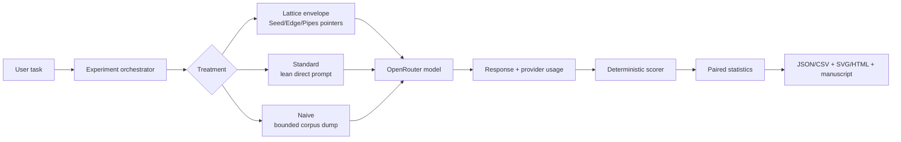

# Introduction {#sec:introduction}

## Context as an experimental variable

A language-model request is not determined only by the user question. It is a composition of a user message, system instructions, repository context, retrieved pointers, tool affordances, and the model's response budget. In a repository agent, these components can be delivered as a compact set of navigational pointers, as a lean direct prompt, or as a large context dump. The practical question is not whether more context is always better, but whether context can be selected and structured so that it improves task performance without making every request pay the cost of the whole corpus.

Lattice Chat Agent operationalizes one answer: a nested prompt envelope identifies a parent execution frame, Seed/Edge/Pipes bands, repository pointers, and mode-specific directives. The envelope is intended to make relevant structure legible while preserving scale-to-zero behavior. The comparison in this manuscript treats the entire envelope as the intervention. It therefore tests the experience of “Lattice context” rather than isolating any single internal mechanism.

## Research questions

**RQ1 — Token economy.** How do provider-reported tokens differ between a pointer-grounded Lattice envelope, a lean direct prompt, and a bounded corpus dump?

**RQ2 — Task performance.** Does explicit repository grounding change accuracy on repository QA, deterministic reasoning, and a patch-generation task?

**RQ3 — Mechanism.** Are any observed differences consistent with answer availability in the prompt envelope rather than with a general reasoning advantage?

**RQ4 — Robustness.** Do the direction and magnitude of effects appear across more than one valid OpenRouter model?

## Claims and non-claims

The supported claim is operational and bounded: in the recorded runs, a pointer-grounded prompt consumed far fewer tokens than the naive corpus-dump baseline, and it sometimes improved repository-answer accuracy relative to a lean prompt. The manuscript does not claim that a nested-agent architecture is universally superior, that token reduction implies equal quality, or that the measured p-value survives correction for task selection, model selection, or repeated exploration.

## System architecture

**Figure interpretation.** The three arms share the task, model, temperature, repetition schedule, and scoring layer. Context construction is the treatment boundary. The orchestrator records order, latency, usage, and scores; the report generator removes raw response text from committed artifacts.

## Related framing

The experiment sits at the intersection of retrieval-augmented generation, context-window management, agent orchestration, and software-engineering evaluation. Its distinctive constraint is not merely retrieval quality: it asks whether a compact architectural description can act as a stable routing layer across heterogeneous repository tasks. The appropriate comparison is therefore multi-objective: accuracy, token cost, latency, and failure mode must be shown together.
