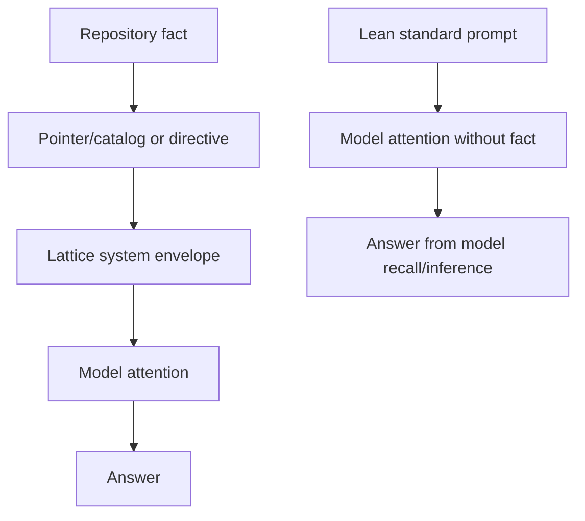

# Formalism {#sec:formalism}

## Context-treatment model

Let $x_i$ denote task $i$, $m$ a model, $r$ a repeat, and $t$ a treatment. A request is represented as

$$
q_{i,m,r,t} = (u_i, s_t, c_t, \tau, b),
$$ {#eq:request}

where $u_i$ is the task prompt, $s_t$ is the treatment system instruction, $c_t$ is treatment-specific context, $\tau=0$ is the sampling temperature, and $b$ is the maximum completion budget. The response is

$$
y_{i,m,r,t} \sim M_m(q_{i,m,r,t}).
$$ {#eq:response}

The experiment compares the joint effect of $(s_t,c_t)$; it does not identify a structural causal effect of any subcomponent.

## Treatments

The standard treatment uses a short direct system instruction and no repository corpus for QA/reasoning. For coding, it receives a bounded snapshot of three current files. The Lattice treatment uses `assembleLatticePrompt` with Goldilocks topology and the same task snapshot as a bounded user-context supplement. The naive treatment concatenates a deterministic, size-ranked set of repository files up to a fixed character budget of 70,000 characters. This operationalizes a fat-context baseline without claiming to reproduce every possible corpus dump.

Let $C_t$ be input characters and $\kappa=4$ the structural chars-per-token approximation. The structural context estimate is

$$
\widehat{K}_t = \left\lceil \frac{C_t}{\kappa} \right\rceil.
$$ {#eq:structural_tokens}

Provider-reported total tokens $K_{i,m,r,t}$ are used for empirical token results whenever available. Structural estimates are never substituted for provider usage in the live-run tables.

## Outcomes

For task correctness, $A_{i,m,r,t}\in\{0,1\}$ is the deterministic strict score. The lenient score $A^{\ell}_{i,m,r,t}$ accepts a repository answer when the expected token occurs in the response and extracts the first numeric answer for reasoning tasks. Coding correctness requires a returned unified diff to apply cleanly and the resulting temporary checkout to pass `npm ci` and `npm test -- --run`.

Latency is $L_{i,m,r,t}$ in milliseconds. Token efficiency is reported as total tokens per correct outcome; when an individual response is incorrect, its token count remains visible and is not deleted. Aggregate `tokensPerCorrect` is therefore an operational burden metric, not a probability estimator.

## Paired contrasts

For two treatments $a$ and $b$, the within-pair difference for outcome $z$ is

$$
\Delta_{i,m,r}^{(z)} = z_{i,m,r,a} - z_{i,m,r,b}.
$$ {#eq:paired_difference}

The paired mean difference is

$$
\bar{\Delta}^{(z)} = \frac{1}{n}\sum_{j=1}^{n}\Delta_j^{(z)},
$$ {#eq:mean_difference}

with standard error $SE(\bar{\Delta})=s_\Delta/\sqrt{n}$. The report includes a two-sided paired t statistic, a Wilcoxon signed-rank statistic where defined, a 95% confidence interval based on the t critical value, and Cohen's paired effect size

$$
 d_z = \frac{\bar{\Delta}}{s_\Delta}.
$$ {#eq:cohens_dz}

These inferential summaries are descriptive because task observations are heterogeneous and the repeat counts are small.

## Alternating order

To reduce a simple time/order confound, repeat $r$ uses treatment order $a,b$ for even-indexed repeats and $b,a$ for odd-indexed repeats. Pair identity is the tuple $(i,m,r)$, never the visual row order in a report.

## Information-flow interpretation

The Lattice envelope can improve a repository QA answer through a direct grounding path:

This is a testable mechanism hypothesis. It predicts the largest advantage on questions whose exact answer is surfaced by the Lattice envelope, not necessarily on closed-form arithmetic.

## Threat model for interpretation

The primary threats are prompt leakage (answer availability differs), unequal context budgets, model-specific instruction-following, strict scoring mismatch, coding-harness failure, multiple exploratory runs, and invalid model identifiers. The protocol records these rather than collapsing them into a single headline.

