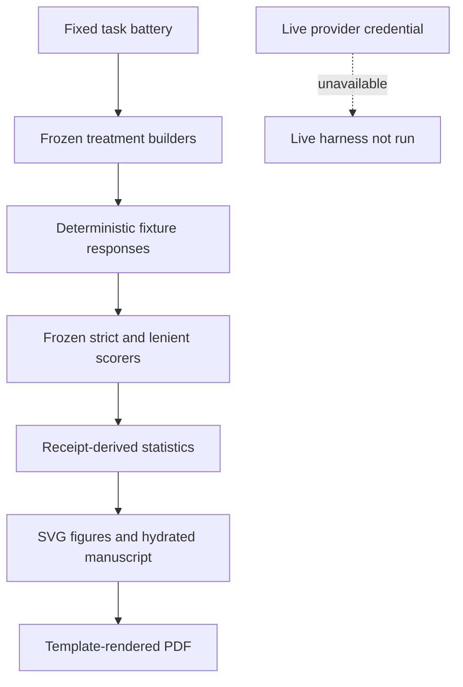

# Methods {#sec:methods}

## Implementation

The live OpenRouter protocol remains frozen in `scripts/lattice-vs-standard-openrouter-usage.mjs` and `lib/openrouter-experiment.mjs`. The follow-up generator imports the same task battery, prompt builders, and strict/lenient scorers. It does not fork scoring or treatment logic. Because no live provider credential was available, the generator supplies explicit deterministic fixture responses and structural controls, writes a receipt with an evidence boundary, and never presents those values as provider measurements.

## Treatment and task design

The fixed battery contains five repository QA tasks, one patch-generation task, and three arithmetic/reasoning tasks. Lattice uses the pointer envelope; standard uses the lean direct prompt; naive uses the deterministic size-ranked corpus dump with the existing character budget. Treatments alternate order within each repeat. Pair identity is `(task, repeat)`.

## Follow-up design

| Field | Receipt-derived value |
|---|---|
| model label | `{{experiment.model}}` |
| repeats | {{experiment.repeats}} |
| tasks | {{experiment.tasks}} |
| observations per treatment | {{experiment.observations_per_treatment}} |
| treatments | {{experiment.treatments}} |
| evidence status | `{{metadata.status}}` |

The larger repeat count is a secondary/post-hoc escalation, not a preregistered confirmatory sample. The live credential-blocked path was not replaced by fabricated provider data.

## Outcomes and statistics

Strict accuracy is binary; lenient accuracy uses the existing scorer's containment/numeric rules. Tokens are structural controls in this receipt. Latency is a deterministic control, not wall-clock provider latency. Tokens-per-correct retains the full token burden for incorrect outcomes. For every metric, the analysis reports treatment means, 95% t-based confidence intervals, paired t, Wilcoxon signed-rank where defined, and Cohen's d_z. The MDE note is an approximate paired-normal planning note, not achieved power; binary accuracy requires a dedicated power model.

## Scope and limitations

The synthetic fixture is useful for verifying determinism, schema, statistics, hydration, visualization, and rendering. It cannot establish model quality, causal effects, production cost, or generalization. The live primary and exploratory receipts remain the source for any provider-specific discussion, and this follow-up does not pool them.

## System boundary

