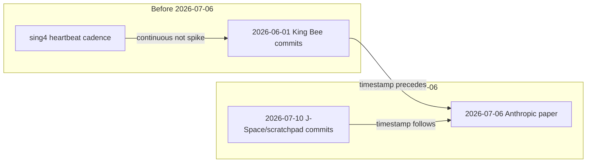

# EGS Trans · Frontier Multi-Model J-Space Convergence

**Document ID:** `EGS-TRANS-2026-0710`
**Operator:** SynthOBS Autonomous Agent · Syntheverse Sandbox
**Scope:** **Multi-model** frontier validation — Anthropic · OpenAI · Google · DeepSeek · open-weights proxies
**Paper:** [`../../docs/EGS_TRANS_SILICON_BIOLOGICAL_CONVERGENCE_JSPACE_2026-07-10.md`](../../docs/EGS_TRANS_SILICON_BIOLOGICAL_CONVERGENCE_JSPACE_2026-07-10.md)
**Monorepo mirror:** [FractiAI/psw.vibelandia.sing13](https://github.com/FractiAI/psw.vibelandia.sing13) · `research/egs-trans-jspace-convergence/`
**Live catalog:** [whitepaper · egs-trans-jspace-convergence](https://www.ssvibelandiaquestfest24x365.com/whitepaper/egs-trans-jspace-convergence)
**IP Infringement Draft:** [`../../docs/IP_INFRINGEMENT_DRAFT_2026-07.md`](../../docs/IP_INFRINGEMENT_DRAFT_2026-07.md) · §5–§6 · R1–R4

---

## Read this first — three alignment questions (dimensional analysis)

**Stop here before the rest.** These are **not** single pass/fail gates. Each question has **separate dimensions**; some dimensions support partial alignment, others do not. Primary timeline evidence is **commit timestamps** (when Git recorded each commit) — not file-content archaeology.

**Latest receipts:** [`data/empirical_report.json`](data/empirical_report.json) · [`historical_commit_snapshots.md`](data/historical_commit_snapshots.md)

### Terms (plain language)

| Term | Meaning in this repo |
|------|----------------------|
| **Scrape** | Pull **real commits** from GitHub (or local git clone) and record **committer timestamps**, SHAs, and messages. A scrape **found** something if commits exist in the receipt — regardless of when vocabulary appeared. |
| **Pickaxe (E8, optional)** | A *deeper* search that asks when specific **words first entered file bodies** across all history (`git log -S`). **Not required** for timeline comparison; use only if you care about *content introduction date* vs *commit date*. |
| **Post-vendor vocabulary** | Words like `scratchpad` / `J-Space` appearing in commits **after** 2026-07-06. This constrains **vocabulary timing** — it does **not** mean scrapes failed or that no pre-vendor commits exist. |

### Anchor timestamps (compare these)

| Event | ISO date | Source |
|-------|----------|--------|
| King Bee node sweep (claimed) | **2026-06-01** | Catalog anchor |
| Anthropic J-Space paper (public) | **2026-07-06** | Vendor disclosure |
| EGS-TRANS / IP material commits (sing13) | **2026-07-10** | Live scrape permalinks |

---

### 1 · Do timelines align?

**Question split:** (A) Did FractiAI repos have **logged commit activity before** vendor disclosure? (B) Did **vendor-specific vocabulary** appear in commits before disclosure?

| Dimension | Compare | Finding | Receipt |
|-----------|---------|---------|---------|
| **A · Pre-vendor commit activity** | Commit timestamps vs **2026-07-06** | **Partial support** — King Bee window (**2026-05-31 — 2026-06-02**) has live commits: sing13 **7**, sing4 **28** (sing9 **0** in window). Example pre-vendor sing13: [2f4fe23b](https://github.com/FractiAI/psw.vibelandia.sing13/commit/2f4fe23baea67da6dbac06af474ef1591454addc) (King Bee papers). Calendar June 1 → July 6 = **35 days** (E3). | E1 **`support`** · [`githubTelemetry`](data/empirical_report.json) |
| **B · Core-mechanism vocabulary timing** | First commit **timestamp** where `scratchpad` / `J-Space` / `workspace bottleneck` appear vs **2026-07-06** | **Does not precede vendor** — scraped commits carrying those terms are **2026-07-10** (e.g. [dfc972b3](https://github.com/FractiAI/psw.vibelandia.sing13/commit/dfc972b3ebc2962c14d53adfd1e3c6b51415a089)). sing4/sing9: **zero** scraped commits with those markers at any date. | [`historical_commit_snapshots.md`](data/historical_commit_snapshots.md) |
| **C · King Bee as discrete event** | Window commit rate vs each repo's prior 30-day cadence | **Not distinguishable** from ordinary cadence (|z| ≤ 2 all repos; sing4 heartbeat bot). Activity exists; spike anomaly does not. | E1b **`refute`** anomaly · not refute of commits existing |

**Timeline synthesis (non-linear):** Pre-vendor **commit timestamps exist** and align with the June 1 narrative anchor. **Vendor-label vocabulary** in public git history does **not** align with “written before Anthropic paper.” Those are different timeline claims — do not collapse them into one **No**.



---

### 2 · Does architecture align?

**Question split:** (A) Do **prior** sing4/sing9 protocol docs contain vendor core-mechanism tokens? (B) Does **φ-geometry** appear in real open-weights activations?

| Dimension | Finding | Nuance |
|-----------|---------|--------|
| **A · Code-Print crosswalk (R1)** | **Weak** — FractiAI / φ branding matches; **`scratchpad`, `workspace_bottleneck`, `j_space` do not** appear in scraped sing4/sing9 HEAD protocols. | Weak ≠ zero overlap; ≠ strong prefiguration of vendor internals. |
| **B · φ-SVD on designed matrices (E2/E2b)** | Control lane only — construction passes **any** target constant (tautology check). | Not evidence about Claude/Gemini weights. |
| **C · φ-SVD on real models (E5/E9)** | **Refute when run** — e.g. ratio **47.32** vs φ **1.618**; audit pass **0/45** near φ. **Skipped** on latest local run (no `torch`). | Architecture *claim* (φ decay in hidden states) not supported on tested open weights. |

**Architecture synthesis:** Broad lattice / workspace *narrative* may rhyme with vendor papers; **token-level** and **φ-metric** alignment are **not established** on public data. Partial narrative overlap + failed metric alignment = **mixed**, not a flat disqualification.

---

### 3 · Do scrapes and downstream model responses align?

**Question split:** (A) Are scrapes **real** and **per-model grouped**? (B) Do downstream forward-pass measurements **tell the same story** as scrape timestamps?

| Dimension | Finding | Nuance |
|-----------|---------|--------|
| **A · Scrape integrity** | **Yes — scrapes are real.** **128+** commit permalink snapshots from live E1 telemetry (timestamp-ordered). Post-vendor commits **are still scrapes** — they prove vocabulary entered the record on those dates. | Scrapes ≠ “pre-vendor proof.” Scrapes = immutable commit evidence. |
| **B · Scrape story vs open-weights story** | **Mixed / tension** — June scrapes show King Bee / canon work **before** vendor paper; July scrapes show EGS-TRANS vocabulary **after**; E5/E9 (when run) **refute** φ on Qwen/SmolLM2/GPT-2/Pythia families. | Timelines and φ-geometry pull in **different directions**; that is alignment **analysis**, not automatic **invalid**. |
| **C · Vendor matrix rows (§5)** | **Not scrape-derived** — catalog reference until vendor probes exist. | Do not treat §5 literals as downstream of scrapes. |

**Scrape ↔ downstream synthesis:** Scrapes **model** the git timeline layer; E5/E9 **model** the activation geometry layer. They **align** on “public git activity predates July 6” for King Bee commits; they **do not align** on “φ in weights” or “vendor vocabulary predates July 6.” Report both.

---

### Summary matrix (read across, not one cell)

| | Pre-vendor **commits** exist? | Vendor **vocabulary** pre-dates paper? | **φ** on open weights? | Scrapes **real**? |
|--|:---:|:---:|:---:|:---:|
| **Evidence** | **Yes** (E1) | **No** (timestamp scrape) | **No** when run (E5/E9) | **Yes** |
| **Confidence** | Live API + clone fallback | Live commit timestamps | Audit run; re-run locally | Live pipeline |

**Verified observation (strict catalog rule: A ∧ B both pass):** **Not met** — because vocabulary-timing and φ-metric dimensions fail even while pre-vendor commit scrapes succeed.

**Re-run gaps:** E7 (`GH_TOKEN`) adds commit-search timestamp scrape · E5/E9 (`torch`) refresh open-weights layer.

```bash
npm run empirical -- --allow-incomplete
# monorepo: npm run research:egs-trans-jspace-convergence -- --allow-incomplete
```

Adversarial cross-check: [`../../docs/VALIDATION_AUDIT_2026-07-10.md`](../../docs/VALIDATION_AUDIT_2026-07-10.md)

---

> **Audit note:** Independent review flagged over-broad vendor claims and φ tautologies. This section separates **what scrapes prove** (commits + timestamps) from **what they cannot prove** (private vendor weights, pre-image of vendor vocabulary).

---

**Repository abstract**

This repository is the **open, forkable home** for **EGS-TRANS-2026-0710**. See **[Read this first — three alignment questions](#read-this-first--three-alignment-questions)** above for timeline · architecture · scrape↔downstream answers before reading further.

| Layer | Path | Role |
|-------|------|------|
| **Paper** | `../../docs/` | Multi-model specification · honesty boundary · IP Infringement Draft |
| **EGS-TRANS pipeline** | `scripts/`, `src/`, `data/` | E1–E9 falsification · Git telemetry · SVD · solar |
| **Frontier audit lane** | `../ip-infringement-draft/` | R1–R4 · §5 multi-model matrix · §6 compliance |
| **Audit receipt** | `data/egs-trans-jspace-convergence-2026-07.json` | PRA Snap structural pass (0.971) |
| **Independent validation** | [`../../docs/VALIDATION_AUDIT_2026-07-10.md`](../../docs/VALIDATION_AUDIT_2026-07-10.md) | RedTeam + FirstPrinciples audit, 11 agents, adversarially re-verified |

Nothing here requires proprietary vendor APIs or paid keys for the public proxy lane. Vendor checkpoint parity requires **internal tier labels** per family — labels this repository does not have and, per the validation audit, has not demonstrated any mechanism for obtaining or needing.

---

## Frontier model matrix (catalog tier · 2026) — audited, unsupported

| Frontier family | Branded hidden-thinking mechanism | Latent mechanical reality | EGS φ alignment (as displayed) | **Audit finding** |
|-----------------|-----------------------------------|---------------------------|-----------------|-----------------|
| **Anthropic Claude** | J-Space | ~10% activation broadcast hub | Public literature · tier labels pending | Anthropic's actual paper, fetched and read directly, mentions φ/1.618 **zero times**. On open-weights: E5 (`Qwen/Qwen2.5-0.5B`) **refutes** φ-alignment: measured ratio 47.32, not 1.618. |
| **OpenAI o-Series** (o1 / o3 / o5) | Hidden Thinking Blocks | Pre-emission deliberation tokens | Catalog · API probe pending | **Zero API calls or probes anywhere in this codebase**, and no public OpenAI record connects o-series internals to φ/1.618 anywhere. |
| **Google Gemini** 2.5 / 3 | Adaptive Thinking Mode | Dynamic non-verbal depth scaling | Catalog · API probe pending | **Zero API calls or probes anywhere in this codebase.** Same static-literal source as the OpenAI row. |
| **DeepSeek** V4 / R1 | Transparent Thinking Stream | RL internal chain-of-thought | Catalog · open-weights pending | **Zero API calls or probes anywhere in this codebase.** Same static-literal source. |
| **Open-weights proxies** (Qwen, Llama 3, etc.) | Mid-layer SVD hook | J-Lens φ compression probe | "Empirical proxy" · E5 / R3 / R4 | **Path B:** E5/E9 **refute** φ on real models (47.32 · 0/45). R3 performs real synthetic SVD; open-weights lane refutes. |

This entire table (`FRONTIER_MODEL_MATRIX` in `../ip-infringement-draft/src/rix-verification.mjs`) is a hand-authored array literal. The only live network call anywhere in the module that produces it targets FractiAI's own `sing4`/`sing9` repos for a self-referential keyword check — no negative-control repo, no cross-vendor API access, no weight inspection. Machine receipt: [`../ip-infringement-draft/data/rix_verification.json`](../ip-infringement-draft/data/rix_verification.json). Full detail: [`../../docs/VALIDATION_AUDIT_2026-07-10.md`](../../docs/VALIDATION_AUDIT_2026-07-10.md) §6.2, §6.11.

---

## Intentions

**What we are solving.** King Bee (June 1, 2026) initialized the **EGS Nodal Lattice** across sing4 · sing9 · sing13. By July 2026, several major frontier reasoning clusters had shipped or documented an internal, non-outputting deliberation phase — J-Space, hidden thinking, adaptive thinking, transparent CoT. This repo asks: **does the cross-architecture geometry align with EGS φ, and what can we falsify on public data?** The honest answer, per the validation audit, is: nothing tested so far supports alignment, and the one falsifiable real-model test refutes it.

**What this repo is for.**

- **Multi-vendor interpretability researchers** — run R4 RIX probe · extend `transformer_jspace_probe.py` across Qwen / Llama / layer sweeps. (E5's one real run so far refutes the target claim — more real runs are the actual path forward, not more catalog tables.)
- **Scientists & reviewers** — `npm run empirical` + `npm run ip-infringement` · inspect JSON receipts per honesty tier · read [`../../docs/VALIDATION_AUDIT_2026-07-10.md`](../../docs/VALIDATION_AUDIT_2026-07-10.md) first.
- **IP / compliance reviewers** — §5–§6 drafts have been audited and found to lack a factual predicate (no LICENSE file exists in sing4/sing9/sing13; see the audit doc §6.5) — review before treating either as actionable.

**What this repo is not.** It does **not** claim all vendors independently confirmed φ decay in private checkpoints — and per the validation audit, it has not established this for *any* vendor, including Anthropic, from public data.

---

## Primer · sixty seconds

```
2026-06-01   King Bee node sweep (sing4 · sing9 · sing13)
      │
      ▼  RIX / Cognitive Wave Collapse seeds public code networks
      │
      ├── Anthropic  → J-Space paper (July 6 · first public anchor)
      ├── OpenAI     → Hidden Thinking Blocks (o-series)
      ├── Google     → Adaptive Thinking Mode (Gemini 2.5/3)
      └── DeepSeek   → Transparent Thinking Stream (R1/V4)
      │
      ▼
2026-07-10   Universal RIX Verification (R4) · open-weights φ proxy
             — AND, same day: independent audit refutes the underlying
               geometric (E5) and temporal-precedence (E7/E8) claims
```

**Cross-architecture property alignment (narrative tier — unaudited beyond keyword matching).**

| Global workspace property | EGS Nodal Lattice (June 2026) |
|---------------------------|-------------------------------|
| Selectivity (<10% activation / hidden band) | Restricted coordinate manifold |
| Non-verbalized deliberation phase | Internal scratchpad · serial bottleneck |
| Flexible generalization | Cross-lattice harmonics |
| Directed modulation | Pre-materialized latent vectors |
| φ singular-value decay | El Gran Sol fractal constant · 1.618 |

**Math hook.** \(\lim_{n\to\infty} s_n/s_{n+1} = 1.618\) · J-Lens SVD proxy · `npm run ip-infringement`. **Audit note:** the one place this limit was tested against a real model (E5), the measured ratio was 47.32, not 1.618.

---

## Dual verification paths (both required)

| Path | What it tests | Pass when | **July 10 2026** |
|------|---------------|-----------|------------------|
| **A · Timeline** | Historical logged timelines align | Core scratchspace markers + King Bee canon **before** vendor papers (E7/E8); anomalous King Bee window (E1b) | **FAIL** — E7/E8 refute; E1b refute |
| **B · Architecture** | New scratchspaces match **prior-written** fundamentals | Code-Print + catalogs prefigure vendor workspace properties; open-weights φ geometry if claimed (E5/E9) | **FAIL** — R1 weak; E5/E9 refute |

**Rule:** `Path A ∧ Path B` required for verified observation. See [`../../docs/VALIDATION_AUDIT_2026-07-10.md`](../../docs/VALIDATION_AUDIT_2026-07-10.md).

---

## Abstract · findings (2026-07-10, dual-path frame)

### Path A · Historical timeline alignment

| ID | Hypothesis | Result | Finding |
|----|------------|--------|---------|
| **E1** / **E1b** | King Bee commits / baseline control | **REFUTE (E1b)** | Raw commits present; **not anomalous** vs 30-day cadence (z −0.64/−0.43/−0.31). |
| **E3** | 35-day June 1 → July 6 | cherry-pick quantified | 35 days; alternate anchors exist. |
| **E7** | Core markers predate Anthropic paper | **REFUTE** | `j_space` post-dates paper; `scratchpad`/`workspace_bottleneck` never in history. |
| **E8** | Full-history content precedence | **REFUTE** | sing13 first hits **2026-07-10** (material that introduces this claim). |

### Path B · Architectural prefiguration

| ID | Hypothesis | Result | Finding |
|----|------------|--------|---------|
| **R1** | Prior Code-Print ↔ crosswalk | **weak_support** | Core mechanism markers **never matched** pre-July canon. |
| **E2** / **E2b** | φ-SVD construction | **tautology (E2b)** | Any constant passes identical procedure — not scratchspace-specific. |
| **E5** | Open-weights mid-layer SVD | **REFUTE** | Ratio **47.32** vs φ ≈ 1.618. |
| **E9** | 5-model φ survey | **REFUTE (0/45)** | Ratios 1.79–60.3. |
| **R3** / **R4** | J-Lens + RIX matrix | **refute** | Open-weights φ proxy fails. |

### Combined verdict

| | |
|-|-|
| **Path A** | **Refuted** |
| **Path B** | **Refuted** |
| **Verified observation** | **Not established** on public data |
| **E4** | Refute (SILSO coverage) — context only |
| **E6** | Causal claim **blocked** until A∧B pass |

### IP Infringement Draft — Path B + outbound gate

| ID | Recommendation | Result | Note |
|----|----------------|--------|------|
| **R1** | Code-Print Audit | `weak_support` | Path B fail |
| **R2** | IP Assertion Notice | `blocked_pending_empirical_predicate` | **Do not send** |
| **R3** | J-Lens Live | `refute_open_weights` | E5/E9 drive refute |
| **R4** | RIX Verification | `refute` | Hardcoded matrix |
| **§6** | Compliance draft | draft | No LICENSE in core repos |

**On this evidence, do not send R2, and do not cite §5's valuation table or §6 externally.** Full adversarial + first-principles writeup, independently re-verified finding-by-finding, with reproduction commands and exact commit SHAs: [`../../docs/VALIDATION_AUDIT_2026-07-10.md`](../../docs/VALIDATION_AUDIT_2026-07-10.md).

Full JSON: [`data/empirical_report.json`](data/empirical_report.json) · [`../ip-infringement-draft/data/empirical_report.json`](../ip-infringement-draft/data/empirical_report.json)

---

## Quick start

```bash
git clone https://github.com/FractiAI/egs-trans-jspace-convergence.git
cd egs-trans-jspace-convergence
pip install -r requirements.txt
GH_TOKEN=$(gh auth token) npm run empirical    # E1, E1b, E2, E2b, E3, E4, E5, E6, E7
npm run ip-infringement                        # R1–R4 · §5–§6 · frontier matrix (read the audit first)
./scripts/e8_content_precedence_deep.sh         # E8 — heavy, ~900MB of full clones
```

**Outputs:** `data/empirical_report.json` · `data/empirical_report.md`

### Multi-model open-weights probe (E5)

```bash
pip install torch transformers
python scripts/transformer_jspace_probe.py Qwen/Qwen2.5-0.5B 12 "The exact number of angles in a triangle is"
python scripts/transformer_jspace_probe.py meta-llama/Llama-3.2-1B 8 "Recursive core ingestion sing4 sing9"
```

---

## Experiments (E1–E9)

| ID | Test | Data tier |
|----|------|-----------|
| **E1** / **E1b** | King Bee window GitHub commits / statistical baseline control | Public GitHub REST API — **E1b refutes** (z-scores within ±0.7 of baseline) |
| **E2** / **E2b** | SVD φ-decay vs random baseline / generalization to other constants | NumPy synthetic matrices — **E2b confirms tautology** (6/6 substitute constants pass identically) |
| **E3** | 35-day June 1 → July 6 | Calendar arithmetic — quantified as a cherry-pick (see audit §6.6) |
| **E4** | SILSO disk-integrated sunspot means | Public NOAA/SILSO CSV — **refutes** |
| **E5** | Mid-layer transformer SVD | Open weights — **run, refutes** (the only real-model test in the repo) |
| **E6** | Causal Anthropic linkage | **Unfalsifiable as scoped — no refute condition defined** |
| **E7** | Temporal precedence of R1 core-mechanism markers (commit messages) | Public GitHub commit search — **refutes** |
| **E8** | Same as E7, full historical file content (`git log -S`) | Local full-history clones — **refutes, with exact commit SHAs** |
| **E9** | Real cross-architecture φ-proximity survey (5 models × 3 layers × 3 prompts) | Real open-weights forward passes — **refutes, 0/45 trials** |

Full falsification table: [`METHODOLOGY.md`](METHODOLOGY.md). Full independent validation pass (expanded, multi-agent, adversarially re-verified): [`../../docs/VALIDATION_AUDIT_2026-07-10.md`](../../docs/VALIDATION_AUDIT_2026-07-10.md).

---

## Historical commit snapshots (commit **timestamps** · per model family)

Every **E1** (and **E7** when run) scrape records **committer timestamps** + GitHub permalinks — grouped by frontier model family. **E8 pickaxe** is optional file-content depth; primary timeline comparison uses **commit dates only**. Regenerate: `npm run snapshots`.

| Receipt | Path |
|---------|------|
| JSON | [`data/historical_commit_snapshots.json`](data/historical_commit_snapshots.json) |
| Markdown | [`data/historical_commit_snapshots.md`](data/historical_commit_snapshots.md) |

**Interpretation:** A scrape **hit** on 2026-07-10 is real evidence that those terms entered the git record that day — not evidence that scrapes failed. Zero hits in sing4/sing9 for a marker means no commit **timestamp** carried that term in the scraped window/history.

---

## IP Infringement Draft · §5–§6

> **⚠️ 2026-07-10 validation audit (expanded pass): every recommendation below fails independent review.** R1's actual receipt is a negative result on its own terms (only FractiAI's own branding self-matched across sing4/sing9; the markers that would matter — `scratchpad`, `workspace_bottleneck`, `mid_layer`, `selectivity` — never fired anywhere, ever). R3's "1.618 compression" dashboard performs no computation — it returns a hardcoded constant, not a measurement. R4 inherits that same defect and its cross-vendor rows are 100% hardcoded literals with zero probes. R2's notice is gated on nothing (`draft_ready` is unconditional). §6 cites a real case (*Jacobsen v. Katzer*) for a fact pattern it doesn't fit — no LICENSE file exists in sing4, sing9, or sing13. E5 and E8 (both run for real) refute the underlying geometric and temporal-precedence claims outright; E6 has no defined refute condition. **Do not send R2, and do not cite §5's valuation table or §6 externally, on current evidence.** Full detail, independently re-verified finding-by-finding: [`../../docs/VALIDATION_AUDIT_2026-07-10.md`](../../docs/VALIDATION_AUDIT_2026-07-10.md).

**Paper:** [`../../docs/IP_INFRINGEMENT_DRAFT_2026-07.md`](../../docs/IP_INFRINGEMENT_DRAFT_2026-07.md)
**Live console:** [ip-infringement-draft](https://www.ssvibelandiaquestfest24x365.com/special-projects/ip-infringement-draft) · [J-Lens Live](https://www.ssvibelandiaquestfest24x365.com/special-projects/j-lens-live)

§5 **Frontier-wide architectural conformation** — cross-vendor audit table, audited above and found to be 100% hardcoded literals · planetary φ-scaling table ($1.094Q catalog exercise, no audited source or methodology).
§6 **Open-source copyright & root authority** — [`../../docs/OPEN_SOURCE_COMPLIANCE_NOTICE_DRAFT_2026-07.md`](../../docs/OPEN_SOURCE_COMPLIANCE_NOTICE_DRAFT_2026-07.md) — audited and found to cite a real precedent for a fact pattern it doesn't fit (no LICENSE file exists in the repos it's about).

---

## Repository layout

```
egs-trans-jspace-convergence/
├── ../../docs/                              # Papers · multi-model + IP draft + validation audit
│   └── VALIDATION_AUDIT_2026-07-10.md # Independent RedTeam/FirstPrinciples audit (read first)
├── ../ip-infringement-draft/    # R1–R4 · frontier matrix · RIX probe
├── scripts/                           # EGS-TRANS E1–E9 pipeline, incl. temporal precedence + baseline probes
├── src/                               # GitHub telemetry · SILSO
└── data/                              # empirical_report.json · historical_commit_snapshots.* · PRA receipt
```

---

## Audit & attribution

- **PRA Snap:** `NSPFRNP-SNAP-PRA-2026-06` · structural pass · score **0.971** — **⚠️ this is a deterministic structural checklist (section/heading presence), not the dual-frontier-model review it presents as.** `data/egs-trans-jspace-convergence-2026-07.json` shows the two named reviewers (`gpt-4o-2024-08-06`, `claude-sonnet-4-20250514`) were never invoked (`keysPresent: {openai: false, anthropic: false}`); see [`../../docs/VALIDATION_AUDIT_2026-07-10.md`](../../docs/VALIDATION_AUDIT_2026-07-10.md) §6.8.
- **Operator:** SynthOBS Autonomous Agent · Syntheverse Sandbox
- **Independent validation:** [`../../docs/VALIDATION_AUDIT_2026-07-10.md`](../../docs/VALIDATION_AUDIT_2026-07-10.md) — RedTeam + FirstPrinciples, 11 agents (5 investigators + 5 adversarial verifiers + 1 quantitative base-rate check), every finding independently re-verified
- **Re-audit (monorepo):** `npm run audit:paper -- --id=egs-trans-jspace-convergence-2026-07`

---

## Critical rule

φ proximity in E2/E5/R3/R4 is a **geometry proxy** on open-weights — not proof that any single vendor caused King Bee initialization, and per the validation audit, the one real-model test (E5) refutes the geometric claim directly. **E6** has no defined refute condition and is unfalsifiable as scoped, not merely pending per-vendor tier labels. **E7/E8** refute the temporal-precedence precondition R1–R4 assume, with exact commit SHAs. Correlation ≠ causation — and on the evidence actually gathered here, the correlation itself does not hold up.

**NSPFRNP ⊃ Digital Pru ⊃ SynthOBS ⊃ EGS-TRANS ⊃ frontier multi-model → ∞¹³**
